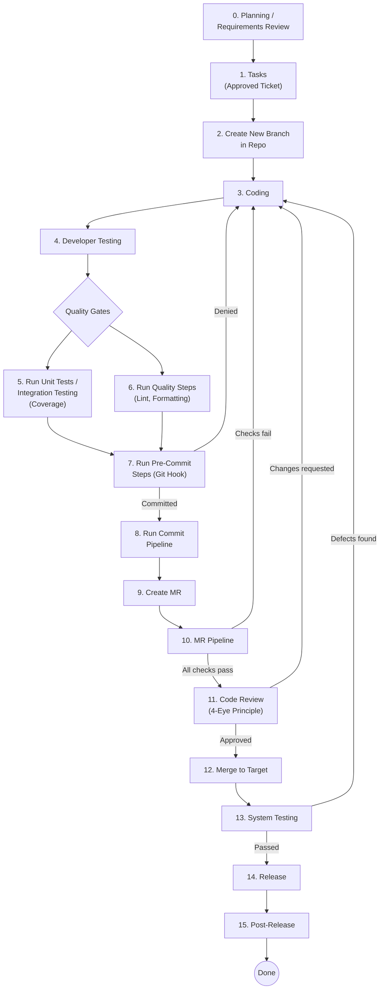

# Developer Workflow

A structured, governance-driven software development lifecycle (SDLC) workflow designed to ensure compliance with the EU AI Act requirements. Each step is mapped to specific requirements from the [EU AI Requirements](eu_ai_requirments.csv) specification.

---

## Workflow Overview



---

## Steps

| # | Step | Requirements | Description |
|---|------|:------------:|-------------|
| 0 | [Planning / Requirements Review](extended-steps/planning_requirements_review.md) | REQ-01 – 04 | Validate functional and non-functional requirements before development begins |
| 1 | [Tasks (Approved Ticket)](steps/task.md) | REQ-01, 03, 04, 05, 11, 23 | Create a compliant development branch from an approved task |
| 2 | [Create New Branch in Repo](steps/task.md) | REQ-01, 03, 04, 05, 11, 23 | Branch creation with naming policy enforcement |
| 3 | [Coding](steps/coding.md) | REQ-01, 03 – 08 | Implement production code and tests following coding conventions |
| 4 | [Developer Testing](steps/developer_testing.md) | REQ-14 – 16, 21 | Integration testing with MCP browser and test containers |
| 5 | [Run Unit Tests / Integration Testing](steps/run_unit_tests.md) | REQ-08, 09, 11, 16 | Execute all tests and enforce coverage thresholds |
| 6 | [Run Quality Steps](steps/run_quality_steps.md) | REQ-05, 06, 11 | Static analysis, linting, and formatting checks |
| 7 | [Run Pre-Commit Steps](steps/run_pre_commit_steps.md) | REQ-06, 08, 10, 11 | Git hook validation before commit is accepted |
| 8 | [Run Commit Pipeline](steps/run_commit_pipeline.md) | REQ-10 – 13 | CI pipeline build, test, and artifact versioning |
| 9 | [Create Merge Request](steps/create_mr.md) | REQ-15, 20 | Create MR with enforced template and title conventions |
| 10 | [MR Pipeline](steps/mr_pipeline.md) | REQ-06 – 09, 11, 13, 16, 18, 23 | Full pipeline re-run with security and license checks |
| 11 | [Code Review](steps/code_review.md) | REQ-21 – 23 | 4-eye principle review — no self-approval, no AI approval |
| 12 | [Merge to Target](steps/merge_to_target.md) | REQ-19, 21 – 23 | Final merge gate after all checks and approvals |
| 13 | [System Testing](extended-steps/system_testing.md) | REQ-02, 14, 15, 17 – 19 | System-level and regression testing before release |
| 14 | [Release](extended-steps/release.md) | REQ-24 – 27 | Release notes, deployment docs, rollback strategy, and approval |
| 15 | [Post-Release](extended-steps/post_release.md) | REQ-28 – 30 | Monitoring, incident management, and retrospectives |

---

## Requirements Coverage

All 30 requirements from the [EU AI Requirements](eu_ai_requirments.csv) are covered:

| Phase | Requirements | Covered In |
|-------|-------------|------------|
| **Planning** | REQ-01 – REQ-04 | Steps 0, 1, 3 |
| **Development** | REQ-05 – REQ-09 | Steps 3, 5, 6, 7, 10 |
| **Build** | REQ-10 – REQ-13 | Steps 7, 8, 10 |
| **Testing** | REQ-14 – REQ-19 | Steps 4, 5, 9, 12, 13 |
| **Merge Request** | REQ-20 – REQ-23 | Steps 1, 9, 10, 11, 12 |
| **Release** | REQ-24 – REQ-27 | Step 14 |
| **Post-Release** | REQ-28 – REQ-30 | Step 15 |

---

## Repository Structure

```
├── README.md                          # This file
├── eu_ai_requirments.csv              # EU AI Act requirements specification
├── AI Workflow (2).pdf                 # Original workflow diagram
├── steps/                             # Core workflow steps
│   ├── task.md                        # Step 1–2: Tasks / Create Branch
│   ├── coding.md                      # Step 3: Coding
│   ├── developer_testing.md           # Step 4: Developer Testing
│   ├── run_unit_tests.md              # Step 5: Run Unit Tests
│   ├── run_quality_steps.md           # Step 6: Run Quality Steps
│   ├── run_pre_commit_steps.md        # Step 7: Pre-Commit Steps
│   ├── run_commit_pipeline.md         # Step 8: Commit Pipeline
│   ├── create_mr.md                   # Step 9: Create MR
│   ├── mr_pipeline.md                 # Step 10: MR Pipeline
│   ├── code_review.md                 # Step 11: Code Review
│   ├── merge_to_target.md             # Step 12: Merge to Target
│   └── workflow.md                    # Core workflow diagram
└── extended-steps/                    # Extended workflow steps
    ├── planning_requirements_review.md # Step 0: Planning
    ├── system_testing.md              # Step 13: System Testing
    ├── release.md                     # Step 14: Release
    ├── post_release.md                # Step 15: Post-Release
    └── workflow.md                    # Extended workflow diagram
```
