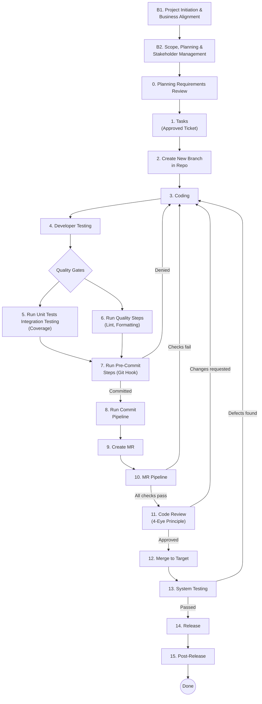

# Developer Workflow

A structured, governance-driven software development lifecycle (SDLC) workflow designed to ensure compliance with the EU AI Act requirements and DORA (Digital Operational Resilience Act). Each step is mapped to specific requirements from the [EU AI Requirements](eu_ai_requirments.csv), [EU AI Business Requirements](eu_ai_business.csv), and [DORA Requirements](software%20dora%20requirements.csv) specifications.

---

## Workflow Overview



---

## Steps

| # | Step | Requirements | Description |
|---|------|:------------:|-------------|
| B1 | [Project Initiation & Business Alignment](extended-steps/project_initiation.md) | BUS-01 – 04, CRT-01 – 05, PM-01 – 04, GOV-01 – 04 | Define business objectives, assess criticality, establish governance and DORA ICT framework |
| B2 | [Scope, Planning & Stakeholder Management](extended-steps/scope_planning_stakeholders.md) | PM-05 – 12, PM-17 – 20 | Define scope, plan milestones/resources/budget, and set up stakeholder communication |
| 0 | [Planning / Requirements Review](extended-steps/planning_requirements_review.md) | REQ-01 – 04, PM-13 – 16, PM-21 | Validate requirements, establish risk management and quality objectives |
| 1 | [Tasks (Approved Ticket)](steps/task.md) | REQ-01, 03, 04, 05, 11, 23, MR-03 | Create a compliant development branch from an approved task |
| 2 | [Create New Branch in Repo](steps/task.md) | REQ-01, 03, 04, 05, 11, 23, MR-03 | Branch creation with naming policy and branch protection |
| 3 | [Coding](steps/coding.md) | REQ-01, 03 – 08, DEV-01, 03, 04 | Implement code with secure coding, secret scanning, and tests |
| 4 | [Developer Testing](steps/developer_testing.md) | REQ-14 – 16, 21, PM-22, TEST-03 | Integration testing with functional and acceptance criteria validation |
| 5 | [Run Unit Tests / Integration Testing](steps/run_unit_tests.md) | REQ-08, 09, 11, 16, DEV-05, TEST-01 | Execute all tests and enforce coverage thresholds |
| 6 | [Run Quality Steps](steps/run_quality_steps.md) | REQ-05, 06, 11, PM-21, DEV-01 – 03 | Static analysis, linting, secret scanning, and quality enforcement |
| 7 | [Run Pre-Commit Steps](steps/run_pre_commit_steps.md) | REQ-06, 08, 10, 11, DEV-02, 03 | Git hook validation with static analysis and secret scanning |
| 8 | [Run Commit Pipeline](steps/run_commit_pipeline.md) | REQ-10 – 13, CI-02, 04, AUD-01 | CI pipeline build, test, versioned artifacts, and audit trail |
| 9 | [Create Merge Request](steps/create_mr.md) | REQ-15, 20, AUD-02 | Create MR with template, traceability from requirement to MR |
| 10 | [MR Pipeline](steps/mr_pipeline.md) | REQ-06 – 09, 11, 13, 16, 18, 23, CI-01, 03, TEST-01, 02, 05, MR-02, AUD-01 | Full pipeline with security, vulnerability, and DAST/SAST scans |
| 11 | [Code Review](steps/code_review.md) | REQ-21 – 23, PM-23, MR-01 | 4-eye principle review with formal peer review requirement |
| 12 | [Merge to Target](steps/merge_to_target.md) | REQ-19, 21 – 23, MR-02, 03 | Final merge gate with branch protection and quality checks |
| 13 | [System Testing](extended-steps/system_testing.md) | REQ-02, 14, 15, 17 – 19, PM-22, 23, TEST-03 – 05, AUD-02, 03 | System testing with regression, security, traceability, and evidence retention |
| 14 | [Release](extended-steps/release.md) | REQ-24 – 27, PM-23 – 27, REL-01 – 04, DEP-01 | Release with DORA-compliant approval, promotion, and automated deployment |
| 15 | [Post-Release](extended-steps/post_release.md) | REQ-28 – 30, PM-28 – 30, DEP-02, 03, OPS-01 – 03, AUD-03 | Monitoring, incident management, RCA, and evidence retention |

---

## Requirements Coverage

### Technical Requirements (REQ-01 – REQ-30)

All 30 requirements from the [EU AI Requirements](eu_ai_requirments.csv) are covered:

| Phase | Requirements | Covered In |
|-------|-------------|------------|
| **Planning** | REQ-01 – REQ-04 | Steps 0, 1, 3 |
| **Development** | REQ-05 – REQ-09 | Steps 3, 5, 6, 7, 10 |
| **Build** | REQ-10 – REQ-13 | Steps 7, 8, 10 |
| **Testing** | REQ-14 – REQ-19 | Steps 4, 5, 9, 12, 13 |
| **Merge Request** | REQ-20 – REQ-23 | Steps 1, 9, 10, 11, 12 |
| **Release** | REQ-24 – REQ-27 | Step 14 |
| **Post-Release** | REQ-28 – REQ-30 | Step 15 |

### Business Requirements (BUS, CRT, PM)

All 30 requirements from the [EU AI Business Requirements](eu_ai_business.csv) are covered:

| Category | Requirements | Covered In |
|----------|-------------|------------|
| **Business Alignment** | BUS-01 – BUS-04 | Step B1 |
| **Criticality** | CRT-01 – CRT-05 | Step B1 |
| **Project Governance** | PM-01 – PM-04 | Step B1 |
| **Scope Management** | PM-05 – PM-08 | Step B2 |
| **Planning** | PM-09 – PM-12 | Step B2 |
| **Risk Management** | PM-13 – PM-16 | Step 0 |
| **Stakeholder Management** | PM-17 – PM-20 | Step B2 |
| **Quality Management** | PM-21 – PM-23 | Steps 0, 6, 4, 11, 13, 14 |
| **Financial Control** | PM-24 – PM-26 | Step 14 |
| **Delivery & Closure** | PM-27 – PM-30 | Steps 14, 15 |

### DORA Requirements (GOV, DEV, CI, TEST, MR, REL, DEP, OPS, AUD)

All 34 requirements from the [DORA Requirements](software%20dora%20requirements.csv) are covered:

| Category | Requirements | Covered In |
|----------|-------------|------------|
| **Governance** | GOV-01 – GOV-04 | Step B1 |
| **Development** | DEV-01 – DEV-05 | Steps 3, 5, 6, 7 |
| **Build & CI** | CI-01 – CI-04 | Steps 8, 10 |
| **Testing** | TEST-01 – TEST-05 | Steps 4, 5, 10, 13 |
| **Merge Request** | MR-01 – MR-03 | Steps 1/2, 10, 11, 12 |
| **Release Management** | REL-01 – REL-04 | Step 14 |
| **Deployment** | DEP-01 – DEP-03 | Steps 14, 15 |
| **Operations & Monitoring** | OPS-01 – OPS-03 | Step 15 |
| **Audit & Compliance** | AUD-01 – AUD-03 | Steps 8, 9, 10, 13, 15 |

### AI Software Extension (EU AI Act, DORA, BaFin)

For software that uses AI, 6 additional steps from the [AI ACT - BaFin DORA](AI%20ACT%20-%20%20BaFin%20DORA.xlsx) specification are applied. These steps augment the standard workflow with AI-specific regulatory controls. See the [AI Software Workflow](extended-steps-ai-software/workflow.md) for the full diagram.

| AI Step | Augments | Source | Description |
|---------|----------|:------:|-------------|
| [AI Step 1: Requirements & AI Risk Classification](extended-steps-ai-software/ai_requirements_classification.md) | Step 0 | AI Act, DORA, BaFin | Classify AI risk level, identify critical functions, define AI-specific requirements |
| [AI Step 2: Architecture & Design](extended-steps-ai-software/ai_architecture_design.md) | Step 0 → 1 | AI Act, DORA, BaFin | Failover design, environment separation, explainability, human-in-the-loop, data lineage |
| [AI Step 3: AI Development Practices](extended-steps-ai-software/ai_development.md) | Step 3 | AI Act, DORA, BaFin | Version models/prompts, secure ML coding, controlled repositories |
| [AI Step 4: AI Testing](extended-steps-ai-software/ai_testing.md) | Steps 4, 13 | AI Act, DORA, BaFin | Bias/robustness testing, adversarial testing, explainability validation, fallback testing |
| [AI Step 5: AI Deployment](extended-steps-ai-software/ai_deployment.md) | Step 14 | DORA, BaFin | Formal model promotion, rollback capability, segregation of duties |
| [AI Step 6: AI Operations & Monitoring](extended-steps-ai-software/ai_operations_monitoring.md) | Step 15 | AI Act, DORA, BaFin | Drift monitoring, AI decision logging, SIEM integration, incident classification |

---

## Repository Structure

```
├── README.md                          # This file
├── eu_ai_requirments.csv              # EU AI Act technical requirements specification
├── eu_ai_business.csv                 # EU AI Act business & governance requirements
├── software dora requirements.csv     # DORA requirements
├── steps/                             # Core workflow steps
│   ├── task.md                        # Step 1–2: Tasks / Create Branch
│   ├── coding.md                      # Step 3: Coding
│   ├── developer_testing.md           # Step 4: Developer Testing
│   ├── run_unit_tests.md              # Step 5: Run Unit Tests
│   ├── run_quality_steps.md           # Step 6: Run Quality Steps
│   ├── run_pre_commit_steps.md        # Step 7: Pre-Commit Steps
│   ├── run_commit_pipeline.md         # Step 8: Commit Pipeline
│   ├── create_mr.md                   # Step 9: Create MR
│   ├── mr_pipeline.md                 # Step 10: MR Pipeline
│   ├── code_review.md                 # Step 11: Code Review
│   ├── merge_to_target.md             # Step 12: Merge to Target
│   └── workflow.md                    # Core workflow diagram
├── extended-steps/                    # Extended workflow steps
│   ├── project_initiation.md          # Step B1: Project Initiation & Business Alignment
│   ├── scope_planning_stakeholders.md # Step B2: Scope, Planning & Stakeholder Management
│   ├── planning_requirements_review.md # Step 0: Planning
│   ├── system_testing.md              # Step 13: System Testing
│   ├── release.md                     # Step 14: Release
│   ├── post_release.md                # Step 15: Post-Release
│   └── workflow.md                    # Extended workflow diagram
└── extended-steps-ai-software/        # AI Software Extension (EU AI Act, DORA, BaFin)
    ├── ai_requirements_classification.md # AI Step 1: Requirements & AI Risk Classification
    ├── ai_architecture_design.md      # AI Step 2: Architecture & Design for AI Systems
    ├── ai_development.md              # AI Step 3: AI-Specific Development Practices
    ├── ai_testing.md                  # AI Step 4: AI-Specific Testing
    ├── ai_deployment.md               # AI Step 5: AI-Specific Deployment
    ├── ai_operations_monitoring.md    # AI Step 6: AI Operations & Monitoring
    └── workflow.md                    # AI Software workflow diagram
```
