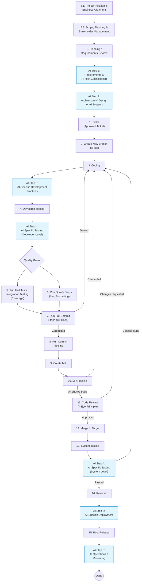

# AI SDLC Workflow (AI Software Extension)

This workflow extends the standard SDLC with AI-specific steps required by the **EU AI Act**, **DORA**, and **BaFin** for software that uses AI. Each AI step augments a corresponding standard step and adds regulatory controls specific to AI systems in financial services.

---

## AI Steps Overview

| AI Step | Standard Step Augmented | Regulatory Source | Description |
|---------|------------------------|:-----------------:|-------------|
| [AI Step 1: Requirements & AI Risk Classification](ai_requirements_classification.md) | Step 0 (Planning) | AI Act, DORA, BaFin | Classify AI risk level, identify critical functions, define AI-specific requirements |
| [AI Step 2: Architecture & Design](ai_architecture_design.md) | Between Step 0 and Step 1 | AI Act, DORA, BaFin | Design failover, environment separation, explainability, human-in-the-loop, data lineage |
| [AI Step 3: AI Development Practices](ai_development.md) | Step 3 (Coding) | AI Act, DORA, BaFin | Version models/prompts, secure ML coding, controlled repositories |
| [AI Step 4: AI Testing](ai_testing.md) | Steps 4, 13 (Testing) | AI Act, DORA, BaFin | Bias/robustness testing, adversarial testing, explainability validation, fallback testing |
| [AI Step 5: AI Deployment](ai_deployment.md) | Step 14 (Release) | DORA, BaFin | Formal model promotion, rollback capability, segregation of duties |
| [AI Step 6: AI Operations & Monitoring](ai_operations_monitoring.md) | Step 15 (Post-Release) | AI Act, DORA, BaFin | Drift monitoring, AI decision logging, SIEM integration, incident classification |
