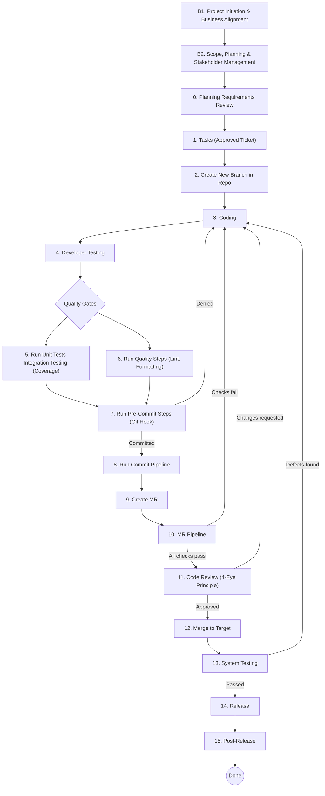

# AI SDLC Workflow (Extended)

```mermaid
flowchart TD
    B1["B1. Project Initiation & Business Alignment"] --> B2["B2. Scope, Planning & Stakeholder Management"]
    B2 --> P["0. Planning Requirements Review"]
    P --> A["1. Tasks (Approved Ticket)"]
    A --> B["2. Create New Branch in Repo"]
    B --> C["3. Coding"]
    C --> D["4. Developer Testing"]
    D --> E{"Quality Gates"}

    E --> F["5. Run Unit Tests Integration Testing (Coverage)"]
    E --> G["6. Run Quality Steps (Lint, Formatting)"]

    F --> H["7. Run Pre-Commit Steps (Git Hook)"]
    G --> H

    H -->|"Committed"| I["8. Run Commit Pipeline"]
    H -->|"Denied"| C

    I --> J["9. Create MR"]

    J --> K["10. MR Pipeline"]

    K -->|"All checks pass"| L["11. Code Review (4-Eye Principle)"]
    K -->|"Checks fail"| C

    L -->|"Approved"| M["12. Merge to Target"]
    L -->|"Changes requested"| C

    M --> S["13. System Testing"]

    S -->|"Passed"| R["14. Release"]
    S -->|"Defects found"| C

    R --> PR["15. Post-Release"]

    PR --> N(("Done"))
```
