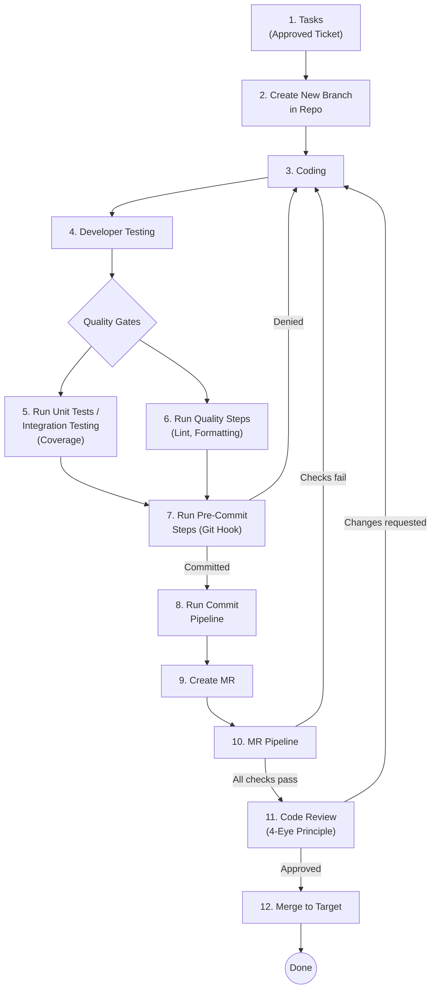

# AI SDLC Workflow

```mermaid
flowchart TD
    A["1. Tasks\n(Approved Ticket)"] --> B["2. Create New Branch\nin Repo"]
    B --> C["3. Coding"]
    C --> D["4. Developer Testing"]
    D --> E{"Quality Gates"}

    E --> F["5. Run Unit Tests /\nIntegration Testing\n(Coverage)"]
    E --> G["6. Run Quality Steps\n(Lint, Formatting)"]

    F --> H["7. Run Pre-Commit\nSteps (Git Hook)"]
    G --> H

    H -->|"Committed"| I["8. Run Commit\nPipeline"]
    H -->|"Denied"| C

    I --> J["9. Create MR"]

    J --> K["10. MR Pipeline"]

    K -->|"All checks pass"| L["11. Code Review\n(4-Eye Principle)"]
    K -->|"Checks fail"| C

    L -->|"Approved"| M["12. Merge to Target"]
    L -->|"Changes requested"| C

    M --> N(("Done"))
```
